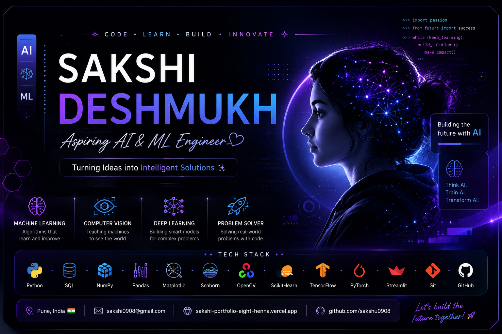

# Hi 👋, I'm Sakshi Deshmukh
🎓 MCA Graduate

Aspiring AI & Machine Learning Engineer passionate about building practical projects and continuously learning new technologies.

---

## 👩‍💻 About Me
* 🤖 Passionate about Artificial Intelligence, Machine Learning, and Computer Vision
* 💻 Love solving real-world problems using Python
* 🚀 Building AI and Machine Learning projects to improve my skills
* 📚 Currently learning Deep Learning and Computer Vision
* 🌱 Always eager to learn new technologies

---

## 🛠️ Technical Skills

### Programming Language
* Python

### Database
* SQL

### Libraries
* NumPy
* Pandas
* Matplotlib
* Seaborn
* OpenCV

### Domains
* Machine Learning
* Deep Learning
* Computer Vision

---

## 🚀 Featured Projects

### 🧠 Customer Churn Prediction
A machine learning project for analyzing customer data and predicting customer churn.
🔗 [View Project](your-repo-link-here)

### 👩‍💻 Face Recognition Attendance System
A face recognition-based attendance system developed using Python and Computer Vision concepts.
🔗 [View Project](your-repo-link-here)

### 🔥 AI Fraud Detection
A machine learning project developed to detect fraudulent transactions using classification techniques.
🔗 [View Project](your-repo-link-here)

### 🌐 Personal Portfolio
A personal portfolio website showcasing my projects and learning journey.
🔗 [Visit Portfolio](https://sakshi-portfolio-eight-henna.vercel.app/)

---

## 🌱 Currently Learning
* Deep Learning (ANN & CNN)
* Computer Vision
* Advanced Machine Learning

---

## 📊 GitHub Stats

---

## 📫 Connect with Me
* GitHub: https://github.com/sakshu0908
* Portfolio: https://sakshi-portfolio-eight-henna.vercel.app/

---

⭐ Thank you for visiting my profile!
